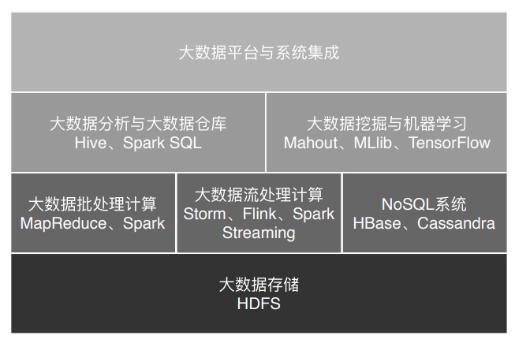

# Overview

软件编程技术的核心价值：提升生活和工作的效率。手段：

* 传统软件开发：需求-分析-开发
* 面向 AI 开发：挖掘用户自己都没发现的需求，洞悉用户自己都不了解的自己

## 大数据的发展史

从萌芽，到 Google 三驾马车，再到 Hadoop

* 2003 年至 2006 年，Google 发表[三驾马车](https://blog.csdn.net/lixinkuan328/article/details/81839824)
  * Google File System，GFS
  * 大数据分布式计算框架，MapReduce
  * NoSQL 数据库系统 BigTable
* 2006 年 Doug Cutting 启动 Hadoop，主要维护 Hadoop 分布式文件系统 HDFS 和大数据计算引擎 MapReduce
* 2008 年 Hadoop 成为 Apache 顶级项目，Doug Cutting 成为 Apache 基金会主席
* 2008 年 运行 Hadoop 的商业公司 Cloudera 成立，Hadoop 得到进一步的商业话
* 2013 年大数据元年
* 2016 年 Google AlphaGo 横空出世

### Google 的思路

2003 年左右，大多数公司聚焦于单机，思考如何提高单机的性能，寻找更贵更好的服务器。但是 Google 的思路是部署一个大规模的服务器集群，通过分布式的方式将海量数据存储在这个集群上，然后利用集群上的所有机器进行数据计算。

这样一来，Google 不需要购买很多很贵的机器，只需要很多普通的机器就可以变得很厉害。

### see also

* [大数据的过去](https://blog.csdn.net/cincoutcin/article/details/80586050)
* [Apache 基金会主席 Doug Cutting 谈 Hadoop 和开源](https://www.infoq.cn/article/doug-on-hadoop-open-source)

## 大数据技术的发展

* 2006 年 Doug Cutting 启动 Hadoop
* Yahoo 开发 Pig。开发人员使用 Pig 描述要对大数据集进行的操作，Pig 经过编译后会生成 MapReduce 程序，然后运行在 Hadoop 上
  * Pig 是一种脚本语言，使用的是类 SQL 语法。这是一种新的语言，存在学习的成本。
* FackBook 开发 Hive 来代替 Pig。Hive 使用的是 SQL。
* MapReduce 被拆分为执行引擎、资源调度系统
  * 资源调度系统成为一个独立的项目开始运营，即 Yarn
  * MapReduce 执行引擎由于其性能和磁盘存储介质的限制，被 UC 伯克利 AMP 实验室所开发的 Spark 替代。
* 大数据生态逐渐形成：Sqoop、Flume、Oozie
* 流式计算引擎的兴起：Strom、Flink、Spark Streaming
* NoSQL 系统主要处理大规模海量数据的存储与访问
  * HBase 是从 Hadoop 分离出来的、基于 HDFS 的 NoSQL 系统

### 大数据处理的主要应用场景

大数据处理的主要应用场景包括以下两个场景：

* 数据分析：使用 Hive、Spark SQL 等 SQL 引擎完成
* 数据挖掘和机器学习：使用专门的机器学习框架 TensorFlow、Mahout 以及 MLib 等，内置了主要的机器学习和数据挖掘算法

### Hadoop 的源码

Hadoop 是使用 Java 编写的软件，但并没有使用高深的技术，使用的都是最基础常见的编程技巧。

## 面向 AI 编程

软件的核心业务逻辑和价值将围绕机器学习的结果，也就是 AI 展开。软件工程师的工作就是考虑如何将机器学习的结果更好地呈现出来，如何更好地实现人和 AI 之间的交互。

AI 不仅是一种结果，更是一种可交互的智能存在。因此，在学习 AI 的过程中不仅需要关注于机器学习的结果，更需要关注于人与 AI 之间的交互过程。

### AI 不是神学

AI 不是万能的东南。当机器学习出现了问题，不要陷入某种不可知的玄学，而是应该积极参与问题的讨论、分析和解决。

### 价值导向

在软件开发过程中，应该多思考，我们所开发的软件的价值点在哪里？真正需要使用软件实现价值的地方在哪里？我们应该关注业务、理解业务，有价值导向。
