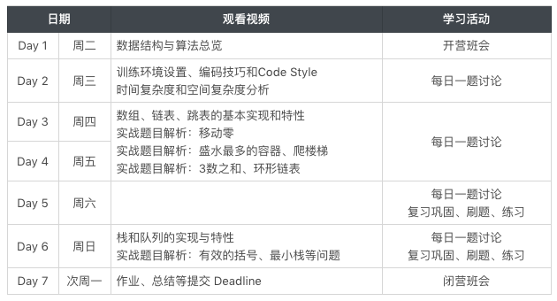

# 班会

* 每日一题
  * 完成 3 次分享，**可领取训练营题库**
* 作业
  * 代码题目
  * 学习总结
  * 完成作业，**可领取课件与直播视频**
* **覃超老师直播** 20191107 20:30~22:00 
* 助教答疑时间 20:30~9:30

## 7 天课表

* 7 天小课包含 7 种基本的常见数据结构
    

## 每日一题

* [https://leetcode-cn.com/problems/remove-duplicates-from-sorted-array/](https://leetcode-cn.com/problems/remove-duplicates-from-sorted-array/)
* [https://leetcode-cn.com/problems/rotate-array/](https://leetcode-cn.com/problems/rotate-array/)
