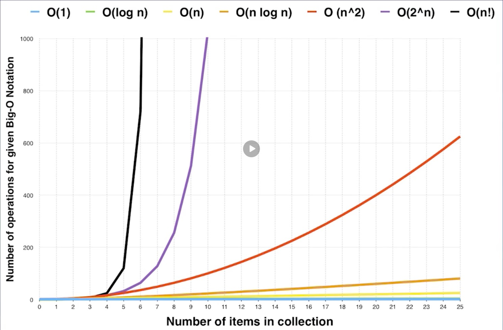

# Precondition and Complexity
## Precondition

[自顶向下的编程方式](https://markhneedham.com/blog/2008/09/15/clean-code-book-review/)

## Complexity

* [如何理解算法时间复杂度的表示方法](https://www.zhihu.com/question/21387264)
* [主定理](https://zh.wikipedia.org/wiki/%E4%B8%BB%E5%AE%9A%E7%90%86)
* [Master theorem](https://en.wikipedia.org/wiki/Master_theorem_(analysis_of_algorithms))

### Time complexity
#### Big O notation

常见的时间复杂度（使用大 O 表示法表示）

* O(1): constant complexity 常数复杂度
* O(log n): logarithmic complexity 对数复杂度
* O(n): linear complexity 线性时间复杂度
* O(n^2): N square complexity 平方
* O(n^3): N cube complexity 立方
* O(2^n): exponential complexity 指数
* O(n!): factorial 阶乘

注意：

* 只看最高复杂度的运算。
* `O` 表示时间复杂度是 n 的怎么样的一个函数。



#### 常见时间复杂度的代码示例

```java
// O(1)
int n = 1000;
System.out.println("Hey - your input is:" + n);
```

```java
// O(1)
int n = 1000;
System.out.println("Hey - your input is:" + n);
System.out.println("Hmm..I'm doing more stuff with:" + n);
System.out.println("And more" + n);
```

```java
// O(n)
for (int i = 1; i <= n; i++) {
  System.out.println("Hey - I'm busy looking at:" + i);
}
```

```java
// O(n^2)
for (int i = 1; i <= n; i++) {
  for (int j = 1; j <= n; j++) {
    System.out.println("Hey - I'm busy looking at:" + i + " and " + j);
  }  
}
```

```java
// O(log(n))
for (int i = 1; i < n; i = i * 2) {
  System.out.println("Hey - I'm busy looking at:" + i);
}
```

```java
// O(k^n)
int fib(int n) {
  if (n <= 2) return n;
  return fib(n - 1) + fib(n - 2);
}
```

#### 如何求递归程序的时间复杂度

例题：Fibonacci 数列的第 n 项

#### 主定理

任何分治或递归的程序都可以通过**主定理**算出其时间复杂度。

### Space complexity
