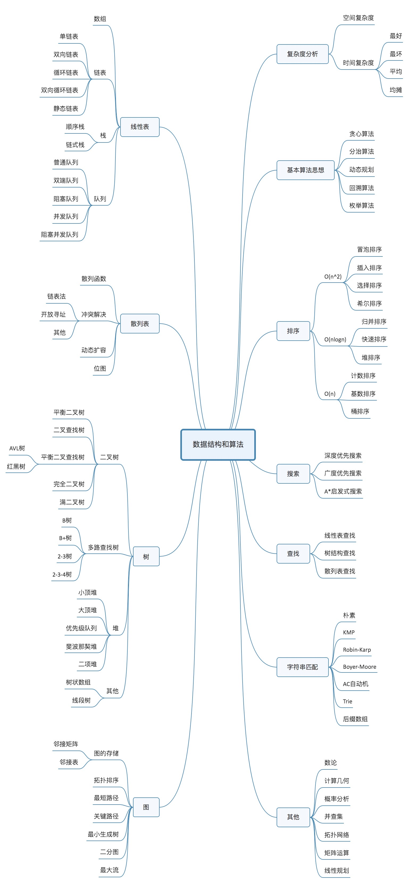

# Chapter0 Introduction - How To Learn Data Structrue And Algo?
## 学习原则和方法

* 实用：学习的内容应当是生活和工作里常见的
* 高效：学习的过程采用不同的学习方式来实现 OKR，如以下几种方式
  * 知识树：使用思维导图来从整体上掌握数据结构与算法的知识树
  * 熟练度：
    * 通过间隔性的重复练习来提高知识点的熟练度
    * 手写代码增强知识点的熟练度
    * 通过回忆练习来增加熟练度
    * 阅读笔记，想象问答
    * 与人交流来提高知识认知级别和熟练度
  * 实战能力：
    * 适度刷题
    * 源码分析
  * 剖析总结不同种类的数据结构与算法在学习方法上的通用性，如以下几点
    * 存储结构上的特点
    * 设计思想
    * 使用场景
    * 代码实现
    * 使用实验验证知识点的正确性
* 定位清晰：不同阶段的学习目标是不同的，这里分为：入门、基础、高级、实战
  * 入门
  * 掌握基础的、常见的知识有 80 分
  * 掌握进阶的、高级的知识变尖子生
  * 进行实战训练走出象牙塔，从学生变工程师

## 学习目标

> 思维导图的“知识结构”一篇可以参考本节，在学习目标这个维度上来编排。

### 学习的重点

> OTT = One + Ten + Ten，比较 OTT 和 25252

* 复杂度分析
  * 数据结构和算法解决的是如何更省、更快地存储和处理数据的问题。因此，我们就需要一个考量效率和资源消耗的方法，这就是复杂度分析方法。
* 数据结构
  * 数组
  * 链表
  * 栈
  * 队列
  * 散列表
  * 二叉树
  * 堆
  * 跳表
  * 图
  * Trie 树
* 算法
  * 递归
  * 排序
  * 二分查找
  * 搜索
  * 哈希算法
  * 贪心算法
  * 分治算法
  * 回溯算法
  * 动态规划
  * 字符串匹配算法

### 专栏内容目录
#### 入门篇

* 掌握时间复杂度、空间复杂度的概念
* 掌握大 O 表示法的由来
* 各种复杂度分析技巧 
* 最好、最坏、平均、均摊复杂度分析方法

#### 基础篇

* 共 26 节课，结合实例学习和掌握最常用最基础的数据结构和算法。

#### 高级篇

* 学习不常用的数据结构和算法，开阔视野，成为尖子生。

#### 实战篇

* 基于开源项目、框架或系统设计问题，来实战串讲前 3 篇的内容。
