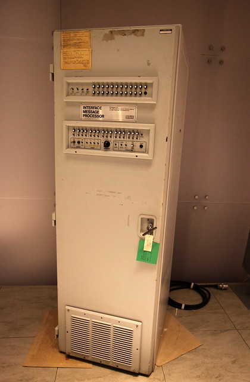

# 第一章
## 网络发展史
### 国外计算机网络发展史 - 3 个阶段

* 萌芽阶段 1955 ~ 1970s
* ARPANet 向 Internet 的转变 1970s ~ 1982
* Internet 走向大众

#### 萌芽阶段 1955 ~ 1970s
* 1957 年，ARPA 成立
  * ARPA 目标是军方潜在的需求，而不是当前现实存在的需求。
* 1969 年，ARPANet 诞生
  * ARPANet 是 Internet 的前身，包括 4 个大学节点。
  * 技术特点：采用分组交换技术，即 Packet Switching。完全不同于当时最主要的通信系统--电话网络所采用的电路交换技术。**分组交换技术让 ARPANet 具备抗毁性**。
  * 抗毁性：当网络中的某些节点不可用，分组可以通过其他节点到达目标主机。
  * IMP：即 Interface Message Processor，

##### IMP

> Steve Jurvetson shot this photo of a Interface Message Processor (IMP) made by BBN, which was as used as a router by APRANET to create one of the first nodes Internet in 1969. It is part of an upcoming exhibition at the Computer History Museum in Mountain View, CA.

#### ARPANet 向 Internet 的转变 1970s ~ 1982

* 互联网之父的瑟夫（Vinton.Cerf）、凯恩（Bob Kahn）、柏兰 登（Bob Braden）等人一起发明出来了被称为成就了互联网的 骨干协议TCP/IP
* 1981年，美国国家科学基金（NSF）成立计算机科学网络（CSnet），并在 Vinton Cerf 的建议下，两网互连。互联网正式诞生。

#### Internet 走向大众

在技术的发展影响和大众需求的影响下，Internet 主键走向普通民众。技术方面主要有以下因素：

* 个人电脑的普及
* 基于 GUI 的操作系统的诞生
* World Wide Web 的诞生

### see also

* [the Internet history](https://www.livinginternet.com/i/i.htm)
* [国外计算机网络发展史](http://www.nethistory.info/)
* [国内计算机网络发展史](http://www.cnnic.net.cn/)

## 参考模型

* 参考模型
  * 参考模型采用了“分而治之”的思想，将复杂的网络分层，每层完成特有的功能，层与层之间相互连接，共同提供网络的功能。
  * 在参考模型上，**任何一次通信，都以发送方的封装开始，以接收方的解封装结束**。
* 协议数据单元 PDU
  * PDU 在各层的名称，如帧、分组/包、数据段

